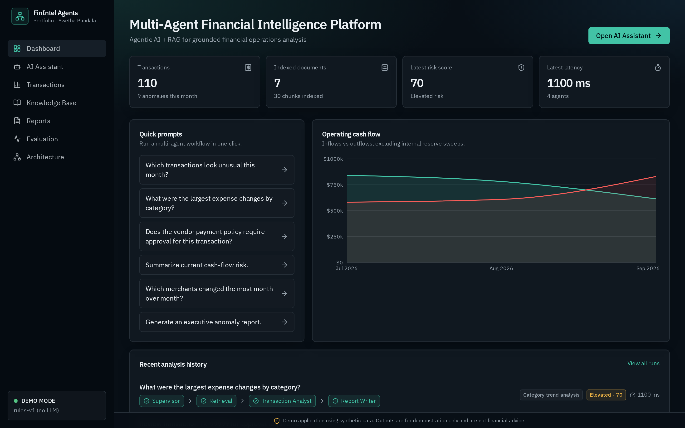
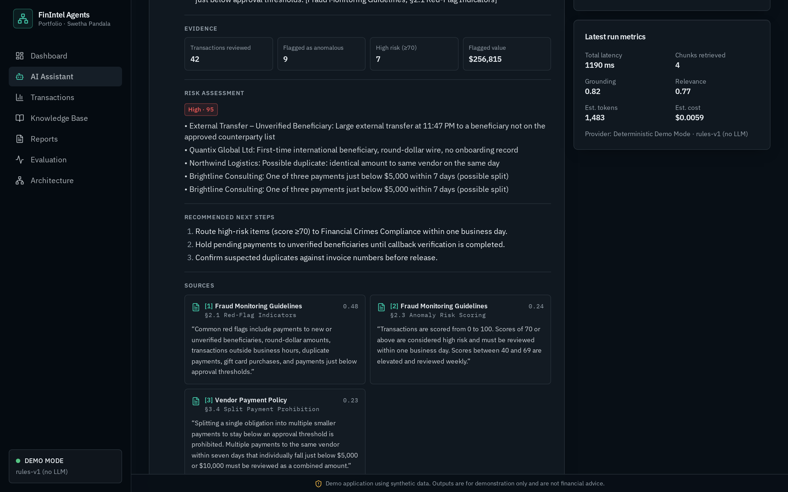
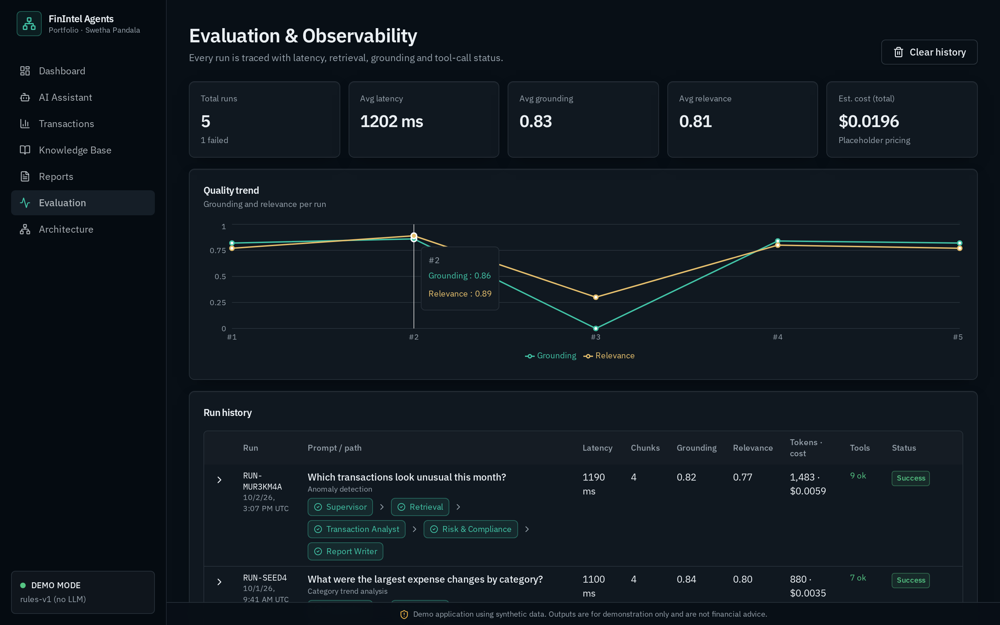

# Multi-Agent Financial Intelligence Platform

A modern, full-stack AI platform for financial operations analysis, built with **React**, **TypeScript**, **TanStack Start**, and **Tailwind CSS** — multi-agent orchestration, RAG with grounded citations, risk scoring, and run-level observability.

If you're looking for an **agentic AI reference** with clean architecture, explainable output, and end-to-end observability — this repo is for you.

> **Live preview:** https://fin-mind-weave.lovable.app

| | |
|---|---|
|  |  |
| *Dashboard — KPIs, quick prompts, cash-flow chart* | *AI Assistant — grounded response with citations & run metrics* |
|  | |
| *Evaluation & Observability — quality trend + run traces* | |

## ✨ Highlights

- **Supervisor-driven multi-agent pipeline** — natural-language queries are classified into 8 intents and routed through a dynamic agent path (Supervisor → Retrieval → Transaction Analyst → Risk & Compliance → Report Writer), so simple questions skip unnecessary agents.
- **RAG with a grounding contract** — retrieval over section-chunked policy documents; the Report Writer may only attach citations returned by the retriever, and withholds answers when nothing relevant is found (no fabrication).
- **Structured, explainable output** — every response is a typed `StructuredResponse`: summary, key findings, evidence, risk assessment, next steps, sources — rendered in dedicated UI widgets.
- **Deterministic financial analytics** — anomaly detection, category/merchant deltas, cash-flow analysis and approval-threshold logic run as pure functions over the ledger; money math is never left to an LLM.
- **Observability & evaluation** — every run records per-agent latency, tool-call status, retrieved chunks, grounding/relevance scores, and token/cost estimates; failures are traced and attributed to the responsible agent.
- **Provider abstraction** — runs out of the box with zero API keys via a deterministic provider; real providers (OpenAI / Anthropic / Bedrock) plug in through server-side code only, so secrets never reach the client.

## 🧰 Tech Stack

- **React** + **TypeScript**
- **TanStack Start v1** — SSR, server functions, file-based routing
- **Tailwind CSS v4** + shadcn/ui + Radix
- **TanStack Query** for data fetching
- **recharts** for visualizations
- **Vite 7** build tooling

## 🤖 Agent Pipeline

```
User prompt
     │
     ▼
Supervisor ── classify intent & plan path (8 intents, 4 pipeline shapes)
     │
     ▼
Retrieval (RAG) ── TF-IDF over policy section chunks · top_k=4 · relevance floor
     │
     ▼
Transaction Analyst ── anomalies, trends, cash flow, approval thresholds
     │
     ▼
Risk & Compliance ── score → Low / Moderate / Elevated / High + indicators
     │
     ▼
Report Writer ── structured response + citations + grounding note
     │
     ▼
AgentRun persisted (path, steps, tool calls, metrics) → Evaluation & Observability
```

## 🚀 Getting Started

### 1) Clone

```bash
git clone https://github.com/<your-username>/multi-agent-financial-intelligence-platform.git
cd multi-agent-financial-intelligence-platform
```

### 2) Install

```bash
bun install    # or npm install
```

### 3) Run locally

```bash
bun run dev    # or npm run dev
```

Runs immediately — no API keys required. To connect a real LLM provider, see `.env.example` and `src/services/providers.ts`; provider keys are read **server-side only** and never reach the client.

### 4) Build

```bash
bun run build    # or npm run build
```

## 🎨 Customize (Quick Guide)

Typical things you'll want to update:

- **Your name** — README footer and `LICENSE`
- **Seed data** — `src/data/` (deterministic, seeded PRNG; identical SSR/client output)
- **Policy documents** — `src/data/documents.ts` (what the retrieval engine indexes)
- **Intents & routing** — `src/services/orchestrator.ts`
- **Branding & theme** — `src/styles.css` design tokens
- **SEO meta/description** — each route's `head()` in `src/routes/`

## 🏗️ Project Structure

```
src/config      centralized, non-secret configuration
src/domain      typed interfaces (Transaction, KnowledgeDocument, Citation, AgentRun, ...)
src/data        deterministic synthetic seed data (seeded PRNG, lazy build)
src/services    orchestrator, retrieval, analytics, risk, reporting, providers, run-store
src/components  app shell & shared widgets (KPIs, agent path, citation cards)
src/routes      dashboard, assistant, transactions, knowledge, reports, observability, architecture
```

Engineering rules (why each layer exists) are documented in `AGENTS.md`.

## 🔑 Key Design Decisions

| Decision | Why |
|---|---|
| UI never computes business logic | Agents/analytics live in `src/services/`, testable without React |
| Single traced entry point (`runAgents()`) | One instrumented path for metrics and observability |
| Citations only from retrieval results | Prevents fabricated sources; enforced by a citation validator |
| Deterministic provider by default | End-to-end operation with zero keys; real providers swap in behind the same interface |
| Seeded, deterministic data | Identical SSR/client output; reproducible runs and tests |
| Per-intent agent paths | Cost/latency control — pay only for the agents a query needs |

## 🌐 Real-World Applications

The same patterns map directly to production systems: fraud/AML monitoring, accounts-payable controls, treasury cash management, and internal policy assistants. The production path: swap localStorage run history for a database behind the same API, TF-IDF retrieval for a hybrid vector store, and add streaming LLM calls in server functions with guardrails, RLS-backed tenancy, and OpenTelemetry-style trace export.

> **Note:** This application uses synthetic data. Outputs are for illustration only and are not financial advice. It is a fresh implementation, not a production or recovered system.

## ⭐ Support

If you found this useful:

- Star this repository (it helps a lot)
- Share it with someone who wants an agentic AI reference implementation

## 🧡 Connect

- **LinkedIn:** [Swetha Pandala](https://www.linkedin.com/) <!-- update with your profile URL -->

## 🏷️ Recommended GitHub Topics (add in repo settings)

```
multi-agent  rag  llm  agentic-ai  typescript  react  tanstack-start  fintech  risk-analysis  observability  retrieval-augmented-generation
```

## 📄 License

This project is open source and available under the [MIT License](LICENSE).
